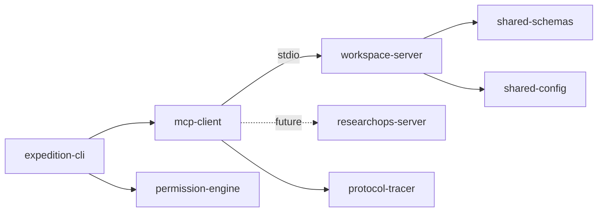

# MCP Expedition

End-to-end learning and reference implementation for the [Model Context Protocol](https://modelcontextprotocol.io/).

## Current status

**Milestone 1 — Foundation complete.** The repository includes a runnable vertical slice:

- Local Workspace MCP server over `stdio`
- Reusable MCP client package
- Expedition CLI host
- Shared schemas, configuration, permissions, and protocol tracing
- Unit and integration tests
- Placeholder package for the future remote ResearchOps server

Remote Streamable HTTP transport, model sampling, elicitation, and registry publication are intentionally not implemented yet.

## Main goals

- Demonstrate MCP hosts, clients, and servers
- Teach protocol initialization, tools, resources, and prompts
- Provide a secure local workspace server pattern
- Grow into remote transport, auth, and Inspector-compatible workflows

## Architecture overview



The CLI is a presentation/host layer. Protocol transport and session logic live in `@mcp-expedition/mcp-client`. Domain validation lives in shared packages. The Workspace server exposes tools/resources/prompts and delegates business logic to services.

## Technology stack

- Node.js 22+
- TypeScript (strict)
- pnpm workspaces + Turborepo
- Official MCP TypeScript SDK
- Zod, Commander, Pino, Vitest
- ESLint, Prettier, Husky, Commitlint, Changesets

## Repository structure

```text
apps/expedition-cli          CLI host
servers/workspace-server    Local stdio MCP server
servers/researchops-server  Remote server placeholder
packages/*                  Shared libraries
examples/sample-workspace   Deterministic fixture content
docs/                       Architecture and security docs
tests/                      Cross-package integration tests
```

## Prerequisites

- Node.js 22 or newer
- pnpm 10+

## Installation

```bash
pnpm install
pnpm build
```

## Development commands

```bash
pnpm typecheck
pnpm lint
pnpm test
pnpm test:unit
pnpm test:integration
pnpm format
pnpm check
pnpm run doctor
pnpm expedition doctor
```

## Running the first demo

```bash
pnpm expedition workspace inspect ./examples/sample-workspace
```

### Expected demo output

The command should:

1. Print discovered tools, resources, and prompts
2. Print a JSON workspace summary for `workspace://summary`
3. Print `search_documents` matches for `risk`, including hits from `risks.md`
4. Exit with code `0`

No LLM API key is required.

## Testing instructions

```bash
pnpm test
```

Integration tests spawn the Workspace MCP server as a subprocess over `stdio` and exercise initialization, capability discovery, resource reads, and tool calls. Tests use deterministic fixtures and do not require network access.

## Security principles

- Workspace root validation and path traversal prevention
- Extension allowlists and file size limits
- Write tools require approval in the permission engine
- `stdio` server logs go to `stderr` only
- Protocol traces redact secrets and file contents

See [docs/security-model.md](docs/security-model.md).

## Roadmap

1. Foundation and local vertical slice _(current)_
2. Human approval UX for write tools
3. Model integration / sampling
4. Roots, progress, and capability-list notifications
5. Remote ResearchOps server over Streamable HTTP
6. Authorization and MCP Inspector interoperability
7. Registry-ready metadata and publication

## Contribution instructions

See [CONTRIBUTING.md](CONTRIBUTING.md). Use Conventional Commits.

## License

MIT — see [LICENSE](LICENSE).
# mcp-expedition
