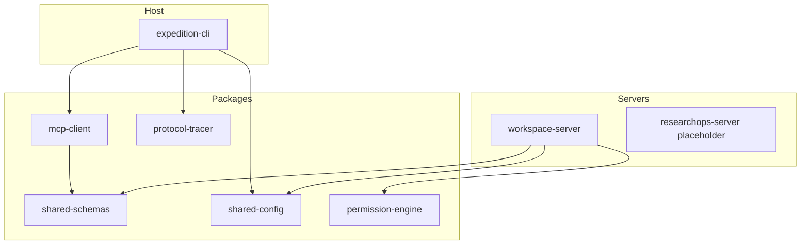
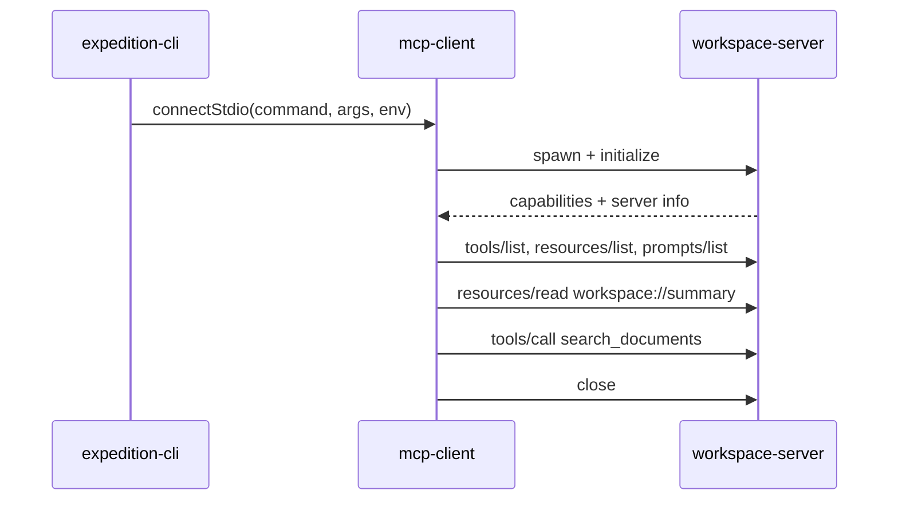

# Architecture

## Host, client, and server responsibilities

| Layer              | Responsibility                                                   |
| ------------------ | ---------------------------------------------------------------- |
| `expedition-cli`   | Argument parsing, user-facing output, exit codes, orchestration  |
| `mcp-client`       | Spawn/connect, initialize, list/call/read MCP surfaces, shutdown |
| `workspace-server` | Local MCP server exposing tools, resources, and prompts          |
| shared packages    | Schemas, config, permissions, tracing                            |

## Local and remote server architecture

- **Local Workspace server** uses `stdio` and operates on one approved workspace root.
- **Remote ResearchOps server** is a placeholder for Streamable HTTP, auth, and shared research domain resources.

## Package boundaries

```text
apps → packages
servers → packages
packages ↛ apps/servers
```

`shared-schemas` remains framework-independent and does not import MCP SDK types.

## Data flow

1. CLI validates the workspace path
2. CLI launches Workspace server as a child process
3. MCP client connects over `stdio` and completes initialize
4. Client discovers tools/resources/prompts
5. Client reads `workspace://summary`
6. Client calls `search_documents`
7. Client closes the session; child process exits

## Dependency rules

- Tool handlers delegate to services
- Environment access is centralized in `@mcp-expedition/shared-config`
- Logging is injected/centralized and never written to `stdout` in stdio servers
- No global mutable application state

## Component diagram



## Initialization sequence



## Why CLI and MCP client are separate

Keeping Commander/terminal rendering out of `@mcp-expedition/mcp-client` lets the same client be reused by future hosts (TUI, web, automation) without dragging presentation concerns into protocol code.
