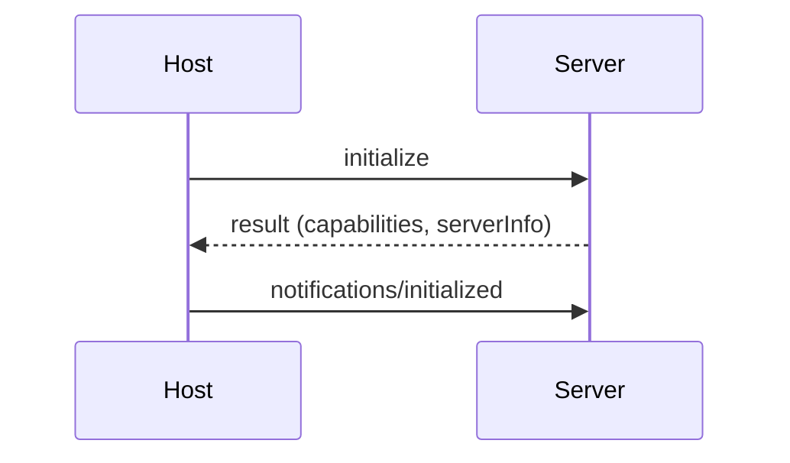
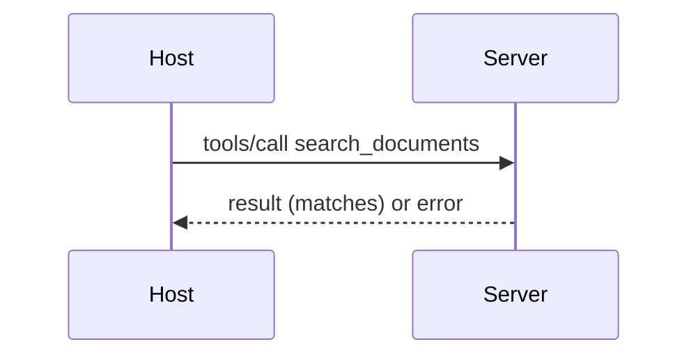

# Protocol sequences

## Initialize

```mermaid
sequenceDiagram
  participant Host
  participant Server
  Host->>Server: initialize
  Server-->>Host: result (capabilities, serverInfo)
  Host->>Server: notifications/initialized
```

## Tool call

```mermaid
sequenceDiagram
  participant Host
  participant Server
  Host->>Server: tools/call search_documents
  Server-->>Host: result (matches) or error
```

Additional sequences for sampling, elicitation, and remote auth will be added in later milestones.
